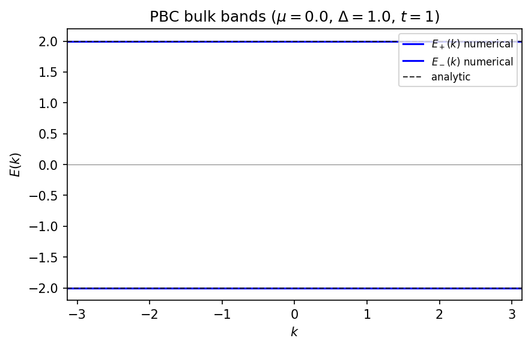
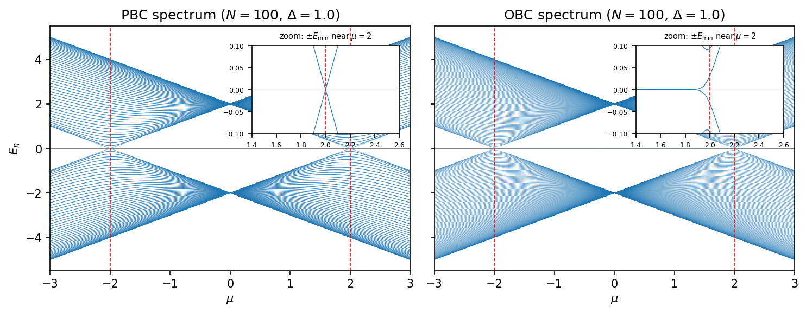
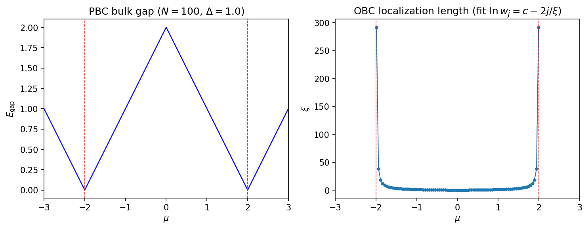
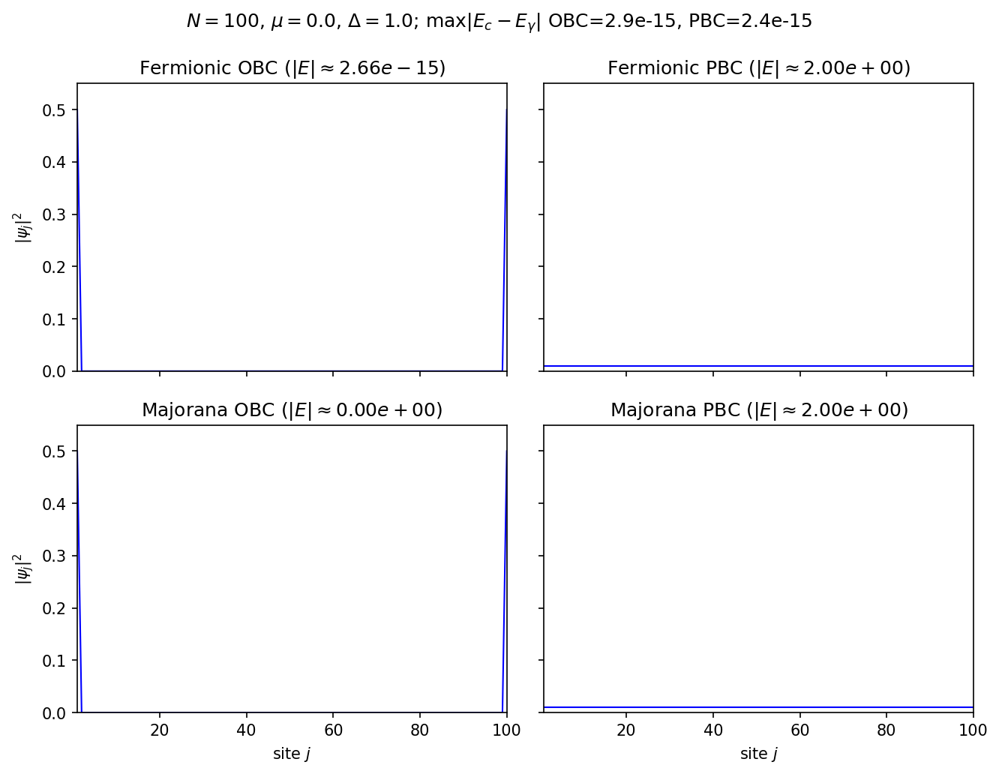
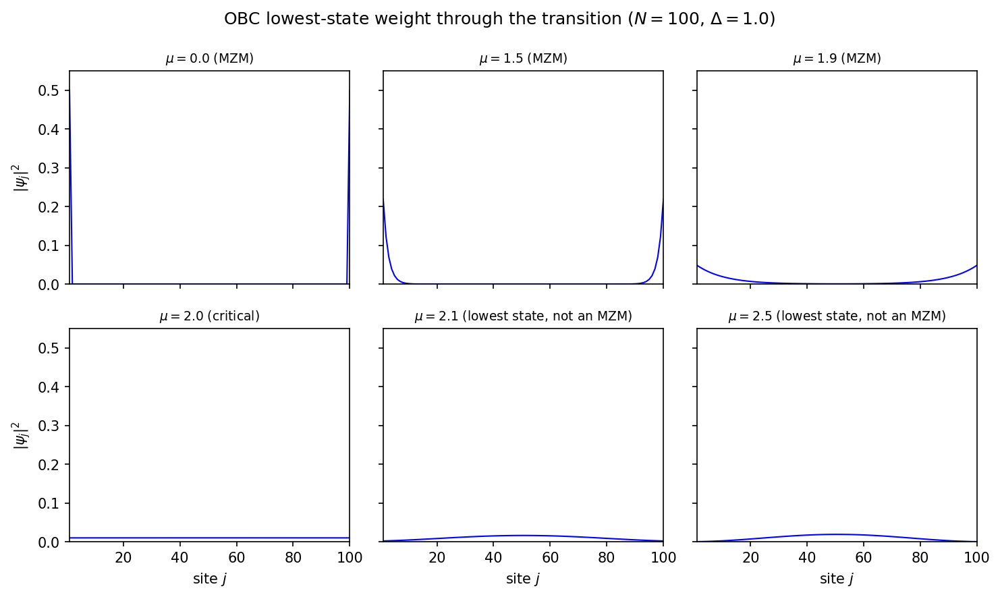
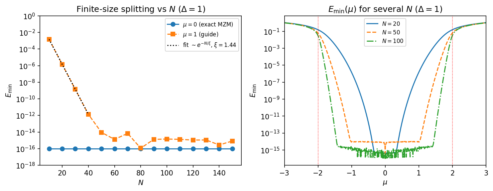
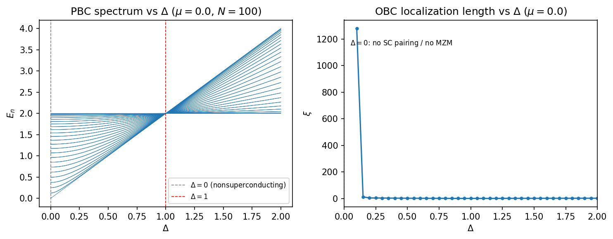

# Numerical Kitaev Chain Study

Self-contained NumPy/SciPy/Matplotlib study of the noninteracting 1D Kitaev chain
in the quadratic \(2N\times 2N\) representation. Hopping is fixed at \(t=1\)
everywhere (not a configurable parameter). Transition points: \(\mu=\pm 2\).

## Setup

```bash
pip install -r requirements.txt
```

## Run

```bash
# Consistency checks (SPEC checklist); writes validation_report.txt
python scripts/validate_representations.py

# Regenerate all seven figures into figures/
python scripts/generate_figures.py
```

## Layout

```text
src/hamiltonians.py       # four Hamiltonians (fermionic/Majorana × OBC/PBC)
src/diagonalization.py    # spectra, gap, Bloch E(k)
src/wavefunctions.py      # site/Majorana weights, localization length
scripts/validate_representations.py
scripts/generate_figures.py
figures/
```

## Conventions

- Fermions: \(c_j^\dagger=(\gamma_{2j}+i\gamma_{2j+1})/2\)
- Majorana form: \(H=(i/4)\gamma^T A\gamma\) with \(A\) real antisymmetric
- Positive quasiparticle energies from eigenvalues of \(iA\) (or BdG)
- Near-zero tolerance: `ZERO_TOL = 1e-9` in `src/diagonalization.py`
- Localization length: least-squares fit \(\ln w_j = c - 2j/\xi\) on the left-edge envelope (undefined in the trivial phase)

## Figures

### Figure 1 — PBC bulk band structure

Majorana PBC Bloch bands at \(\mu=0\), \(\Delta=1\), overlaid with the analytic dispersion \(E_\pm(k)=\pm\sqrt{(\mu-2\cos k)^2+4\Delta^2\sin^2 k}\).



### Figure 2 — PBC vs OBC spectrum across \(\mu\)

Full particle-hole spectrum \(\pm E_n(\mu)\) for \(N=100\), \(\Delta=1\). OBC shows the hybridized MZM pair \(\pm E_{\min}\) near zero for \(|\mu|<2\); PBC does not. Insets zoom on \(|E|\le 0.1\) near \(\mu=2\), where the finite-size splitting is resolvable: the OBC pair stays pinned to zero and then peels away, while the PBC branches simply cross zero at the gap closing.



### Figure 3 — Bulk gap and localization length

PBC gap closes at \(\mu=\pm 2\). OBC localization length \(\xi(\mu)\) grows toward the transition (fit documented above); undefined for \(|\mu|>2\).



### Figure 4 — Representation / eigenstate comparison

Four panels at \(N=100\), \(\mu=0\), \(\Delta=1\): fermionic OBC, fermionic PBC, Majorana OBC, Majorana PBC. OBC states are edge-localized; PBC states are extended. Sorted positive spectra agree to numerical precision.



### Figure 5 — OBC wavefunction through the transition

Site weights for \(\mu=0,1.5,1.9,2.0,2.1,2.5\): localized MZM → broadened edge mode → critical delocalization → loss of the topological edge mode (post-transition states are not labeled MZMs).



### Figure 6 — Finite-size Majorana splitting

(A) \(E_{\min}\) vs \(N\) at \(\mu=0\) (exact zeros) with a \(\mu=1\) exponential guide. (B) \(E_{\min}(\mu)\) for \(N=20,50,100\).



### Figure 7 — Pairing-strength dependence

(A) PBC positive spectrum vs \(\Delta\) at \(\mu=0\). (B) OBC localization length vs \(\Delta\); \(\Delta=0\) is the nonsuperconducting limit (no MZM).


