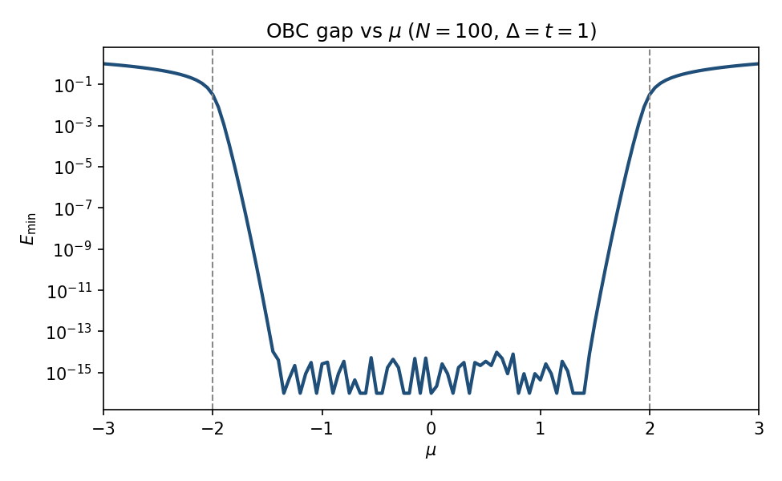
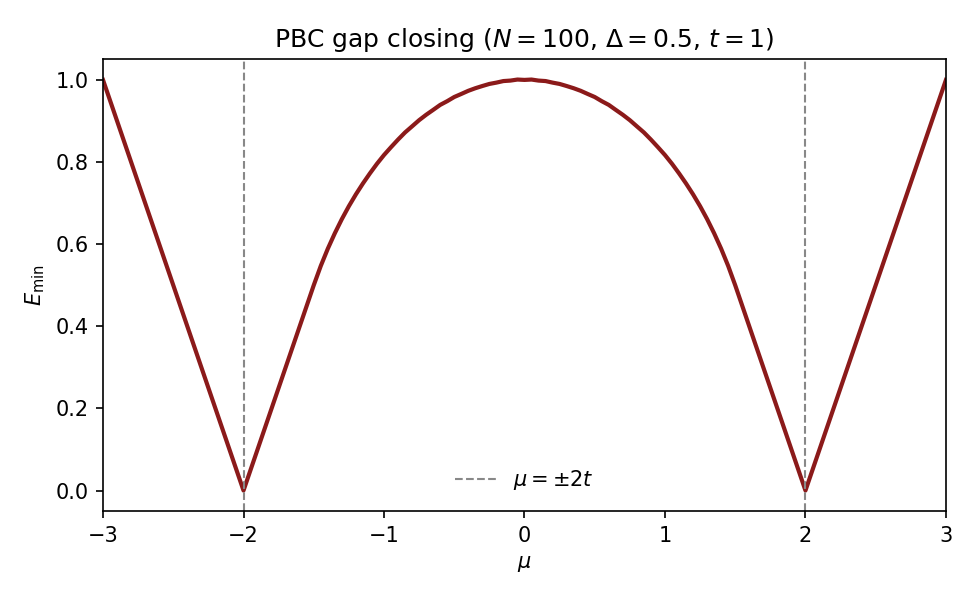
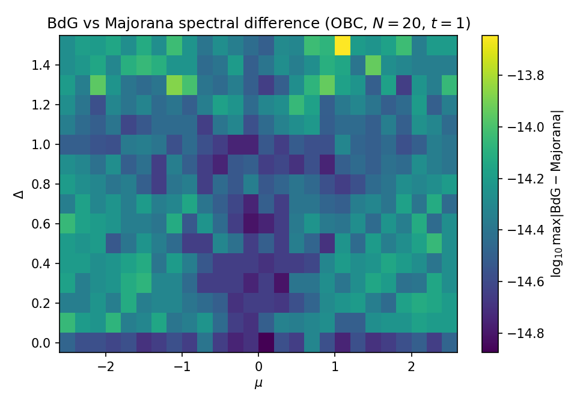

# Kitaev Chain Solver

Diagonalizes the 1D Kitaev chain in BdG (Nambu) and Majorana representations, for open (OBC) and periodic (PBC) boundaries. Both representations return the same quasiparticle spectrum for given `(N, μ, Δ, t, boundary)`.

```python
from kitaev import spectrum

result = spectrum(N=20, mu=0.5, delta=0.8, t=1.0, representation="bdg", boundary="obc")
# result["full"]  — 2N eigenvalues, sorted ascending
# result["E"]     — N non-negative quasiparticle energies
# result["E_gs"]  — ground-state energy = -0.5 * sum(E)
```

Regenerate the figures and table numbers below with:

```bash
pip install -r requirements.txt
python plot_results.py
```

---

## Results

### Gap vs chemical potential (OBC)

At `Δ = t = 1`, the topological phase `|μ| < 2t` hosts Majorana zero modes: `E_min` is exponentially small. Outside that window the spectrum is gapped.



| Parameters | `E_min` |
|---|---|
| N=200, μ=0, Δ=1 (topological) | 4.4×10⁻¹⁶ |
| N=200, μ=3, Δ=1 (trivial) | 1.001 |

### Bulk gap closing (PBC)

Under periodic boundaries the bulk gap closes at the critical points `μ = ±2t` (here `Δ = 0.5`, `t = 1`).



| μ (N=100, Δ=0.5, PBC) | `E_min` |
|---|---|
| 0 | 1.0 |
| ±2 | ~10⁻¹⁶ |
| 3 | 1.0 |

### BdG ↔ Majorana agreement

Maximum absolute difference of the full spectra over a `(μ, Δ)` grid (OBC, N=20). Differences sit at machine precision (~10⁻¹⁴).



Max `|BdG − Majorana|` over the plotted grid: **2.3×10⁻¹⁴**.

### Sample spectrum

OBC, `N=10`, `μ=0`, `Δ=1`, `t=1`:

| | |
|---|---|
| `E` | `[0, 2, 2, 2, 2, 2, 2, 2, 2, 2]` |
| `E_gs` | −9.0 |
